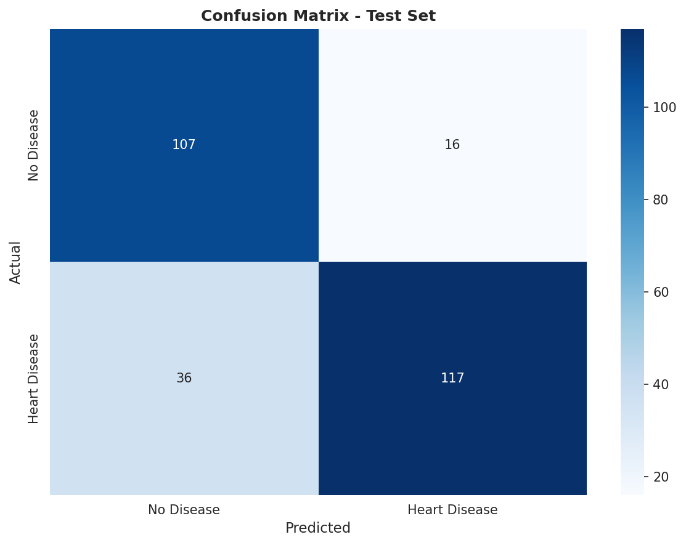

# Heart Disease Prediction

A comprehensive machine learning analysis for heart disease prediction using K-Means clustering and Decision Tree classification. This project implements patient segmentation and disease prediction models to identify risk factors and patterns in cardiovascular health data.

## Overview

This project analyzes a dataset of 918 patient records with 12 clinical attributes to:
- Segment patients into risk clusters using unsupervised learning
- Predict heart disease presence using supervised classification
- Identify key features that contribute to cardiovascular disease

The analysis pipeline includes data preprocessing, feature engineering, model training, and comprehensive evaluation with multiple validation techniques.

## Dataset

The dataset contains the following features:
- **Age**: Patient age in years
- **Sex**: M (Male) or F (Female)
- **ChestPainType**: Type of chest pain (ATA, NAP, ASY, TA)
- **RestingBP**: Resting blood pressure (mm Hg)
- **Cholesterol**: Serum cholesterol (mg/dl)
- **FastingBS**: Fasting blood sugar > 120 mg/dl (1 = true, 0 = false)
- **RestingECG**: Resting electrocardiogram results
- **MaxHR**: Maximum heart rate achieved
- **ExerciseAngina**: Exercise induced angina (Y/N)
- **Oldpeak**: ST depression induced by exercise
- **ST_Slope**: Slope of peak exercise ST segment
- **HeartDisease**: Target variable (1 = disease, 0 = no disease)

## Project Structure

```
heart-disease-prediction/
├── data/
│   └── heart.csv                    # Dataset
├── results/                         # Generated analysis results
│   ├── clustering_optimization.png
│   ├── cluster_distribution.png
│   ├── confusion_matrix.png
│   ├── feature_importance.png
│   ├── performance_metrics.png
│   └── decision_tree.png
├── preprocessing.py                 # Data preprocessing utilities
├── clustering_analysis.py          # K-Means clustering implementation
├── classification_analysis.py      # Decision tree classifier
├── main.py                         # Main analysis pipeline
├── requirements.txt                # Python dependencies
└── README.md
```

## Installation

### Prerequisites
- Python 3.8 or higher
- pip package manager

### Setup

1. Clone the repository:
```bash
git clone https://github.com/yourusername/heart-disease-prediction.git
cd heart-disease-prediction
```

2. Install required packages:
```bash
pip install -r requirements.txt
```

## Usage

Run the complete analysis pipeline:

```bash
python main.py
```

This will execute both clustering and classification analyses, generating all visualizations and result files in the `results/` directory.

### Running Individual Analyses

For clustering analysis only:
```bash
python clustering_analysis.py
```

For classification analysis only:
```bash
python classification_analysis.py
```

## Methodology

### Part 1: Clustering Analysis

The clustering analysis segments patients into distinct groups based on their health characteristics.

**Process:**
1. Data cleaning and duplicate removal
2. Missing value imputation using mean/mode
3. Feature encoding and normalization (0-1 scaling)
4. K-Means optimization testing k=2 to k=15
5. Model evaluation using silhouette score
6. Cluster characterization and outlier detection

**Results:**

The optimal clustering configuration identified 2 distinct patient segments:

| Cluster | Patient Count | Heart Disease Rate |
|---------|---------------|-------------------|
| 0       | 407           | 25.8%            |
| 1       | 511           | 78.9%            |

**Cluster Optimization:**


The silhouette score analysis shows optimal separation at k=2, with a score of 0.315.

**Cluster Distribution:**


Cluster 1 represents a high-risk patient group with nearly 80% disease prevalence, while Cluster 0 shows lower risk characteristics.

### Part 2: Decision Tree Classification

The classification model predicts heart disease presence using a decision tree algorithm with comprehensive validation.

**Process:**
1. Data preprocessing and missing value handling
2. Feature engineering: creation of risk categories
   - Age groups: Teen, Young Adult, Adult, Middle Age, Senior, Elderly
   - Cholesterol levels: Zero, Normal, Borderline, High
   - MaxHR levels: Low, Normal, High
   - Oldpeak risk: Normal, Moderate, Severe
   - RestingBP levels: Normal, Elevated, High
3. Model training with pruning (max_depth=7)
4. 10-fold cross-validation
5. Train-test split evaluation (70-30)

**Performance Metrics:**

| Metric | Score |
|--------|-------|
| Cross-Validation Accuracy | 79.50% (+/- 6.77%) |
| Test Accuracy | 81.16% |
| Precision | 87.97% |
| Recall | 76.47% |
| F1-Score | 81.82% |

**Confusion Matrix:**



The model demonstrates strong performance with high precision, correctly identifying positive cases while maintaining good recall.

**Model Performance:**


All key metrics exceed 75%, indicating robust predictive capability across different evaluation criteria.

**Feature Importance:**


The top contributing features are:
1. **ST_Slope** (70.6%) - Dominant predictor
2. **Cholesterol_Level** (11.1%)
3. **MaxHR** (9.7%)
4. **ChestPainType** (4.7%)
5. **FastingBS** (3.9%)

**Decision Tree Structure:**


The tree structure reveals ST_Slope as the primary decision point, with subsequent splits based on cholesterol and heart rate characteristics.

## Key Findings

1. **Patient Segmentation**: Two distinct patient clusters were identified with significantly different disease prevalence rates (26% vs 79%)

2. **Primary Risk Indicator**: ST_Slope dominates the prediction model, accounting for over 70% of the decision-making process

3. **Model Robustness**: Cross-validation results (79.5%) align closely with test performance (81.2%), indicating good generalization

4. **High Precision**: The model achieves 88% precision, making it reliable for positive disease predictions with low false positive rate

5. **Feature Categories**: Engineered risk categories (cholesterol levels, age groups) contribute meaningfully to prediction accuracy

## Technical Details

**Libraries Used:**
- pandas 2.1.4 - Data manipulation
- numpy 1.26.3 - Numerical computations
- scikit-learn 1.4.0 - Machine learning algorithms
- matplotlib 3.8.2 - Visualization
- seaborn 0.13.1 - Statistical plotting

**Model Parameters:**

*K-Means Clustering:*
- Algorithm: K-Means with Euclidean distance
- Initialization: k-means++ (10 runs)
- Optimization range: k=2 to k=15
- Final k: 2 (based on silhouette score)

*Decision Tree Classifier:*
- Criterion: Gini impurity
- Max depth: 7
- Min samples split: 4
- Min samples leaf: 5
- Pruning: ccp_alpha=0.01
- Random state: 2001 (reproducibility)

## Future Improvements

- Implement ensemble methods (Random Forest, Gradient Boosting)
- Feature selection using recursive elimination
- Hyperparameter tuning with grid search
- Integration of additional cardiovascular biomarkers
- Development of web-based prediction interface
- External dataset validation

## Contributing

Contributions are welcome. Please open an issue first to discuss proposed changes.

## License

This project is available under the MIT License.

## Acknowledgments

Dataset source: UCI Machine Learning Repository - Heart Disease Dataset
